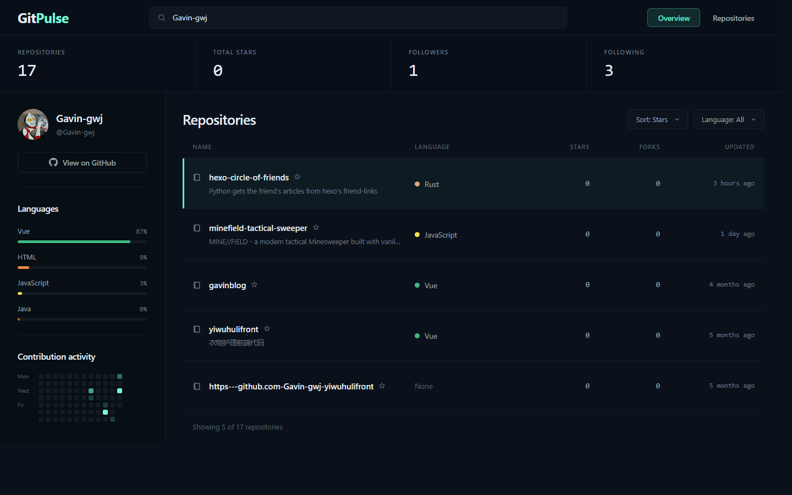

# GitPulse

将任意 GitHub 用户名变成一张清爽的开发者洞察面板：输入用户名，即可看到资料卡、核心指标、语言构成、近期活动热力图与仓库一览。

## 功能

- 按用户名实时拉取 GitHub 公开数据（资料、仓库、公开事件）
- 概览视图：4 项核心指标 + 资料卡 + 语言分布 + 近期活动热力图 + Top 5 仓库
- 仓库视图：全宽仓库表格，支持按 Stars / 最近更新 / 名称排序，按语言筛选
- 表格行点击选中（键盘 Enter / 空格亦可），仓库名直链 GitHub
- URL 直达：?user=torvalds&view=repositories 可分享任意状态
- 离线兜底：GitHub API 不可用时自动回退到内置快照

## 技术栈

- React 19 + Vite 8（Rolldown 内核）
- 纯 CSS 设计系统（design tokens 从 Image Gen 概念稿采样）
- 无 UI 组件库、无运行时依赖，全部自绘（自定义 SVG 图标系统）

## 快速开始

### URL 参数

| 参数 | 取值 | 说明 |
| --- | --- | --- |
| user | 任意 GitHub 用户名 | 默认展示该用户的洞察（默认 Gavin-gwj） |
| view | overview / repositories | 初始视图 |

示例：http://localhost:5173/?user=torvalds&view=repositories

## 数据说明

- 数据源为 GitHub REST API 公开接口，无需令牌；未认证限额 60 次/小时。
- 语言占比按各仓库 size 加权的主语言计算，全部为真实数据推导。
- 活动热力图来自最近 100 条公开事件。
- 内置快照 src/data/fallback.json 可用 npm run fallback -- <用户名> 刷新。

## 目录结构

## 致谢

本项目由 Codex 使用 **Build Web Apps** 插件完成：先由 Image Gen 产出整屏概念设计稿，再按设计稿逐像素还原并通过浏览器截图对比验证；数据与托管由 **GitHub** 插件提供。
